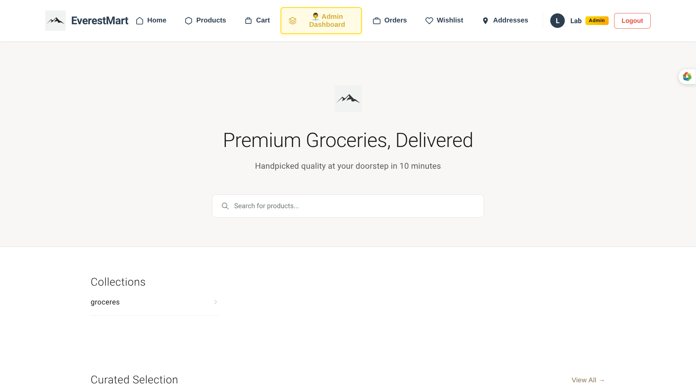
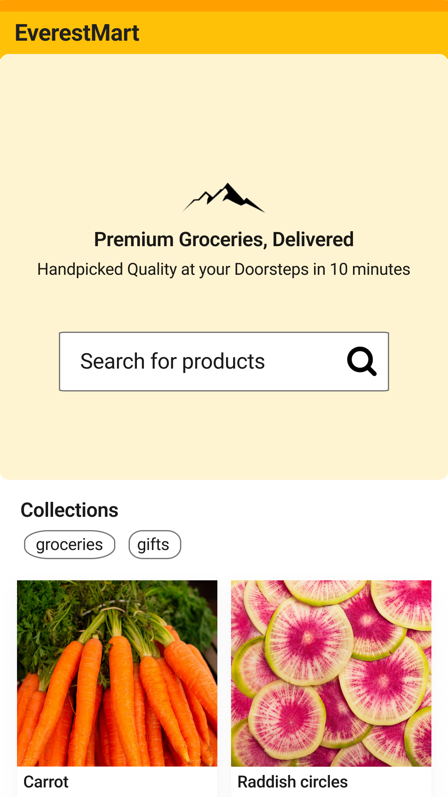

# Myshop Project
MyShop (EverestMart) is a full-stack, production-ready quick-commerce platform designed to support high concurrency, real-time order tracking, and role-based operations across customers, administrators, and delivery riders.

The platform is architected as a multi-client ecosystem, consisting of:
- A Node.js backend API powering business logic and real-time services
- A unified web application for customers, admins, and riders
- A Flutter mobile application focused exclusively on customer shopping experiences

Each component is purpose-built while sharing a common domain model and security layer, ensuring scalability, maintainability, and consistent user experience.

### Preview

**WebApp**

**Android App**

## Architecture Philosophy
- Backend-driven domain logic with strict API contracts
- Single web app serving multiple roles (Client / Admin / Rider)
- Dedicated Flutter mobile app optimized for buyers
- JWT-based authentication across all clients
Real-time communication for order lifecycle events

This approach minimizes duplication, improves consistency, and allows independent scaling of services.

## Repository Structure
This repository contains:
- Backend services (Node.js + Express + MongoDB)
- Web frontend (role-aware single web app)
- Flutter mobile client (buyer-only)

## Server
The server runs on nodejs. It provides api for the following features:
1. Express.js
    - Library: express
        Acts as the core HTTP server framework

    - Handles:
        - API routing (User, Auth, Product, Order, Rider, Admin)
        - Middleware chaining
        - Request/response lifecycle
        - Forms the foundation of all REST APIs in the system

2. CORS
    - Library: cors
        - Enables Cross-Origin Resource Sharing
        - Allows secure access from:
        - Flutter mobile apps
        - Admin web dashboards
        - Rider applications
        - Configurable per environment (development / production)

3. Environment Configuration
    - Library: dotenv
        - Loads environment variables from .env

    - Used for:
        - Database connection strings
        - JWT secrets
        - API keys (SendGrid, Twilio, Firebase)
        - Payment & OAuth credentials

4. Security Middleware
    - Libraries:
        - helmet
        - express-mongo-sanitize
        - express-rate-limit
        - compression

    - Purpose:
        - helmet: Adds HTTP security headers
        - mongo-sanitize: Prevents NoSQL injection attacks
        - rate-limit: Protects authentication and OTP endpoints from brute-force attacks
        - compression: Gzip compression for faster API responses

5. Authentication & Authorization
    - Libraries:
        - jsonwebtoken
        - bcryptjs
        - express-session
        - passport
        - passport-google-oauth20
        - firebase-admin

    - Features:
        - JWT-based authentication for:
        - Users
        - Admins
        - Riders
        - Role-based access control (RBAC)
        - Password hashing using bcryptjs
        - Google Sign-In:
            - Client authenticates via Firebase
            - Backend verifies tokens using firebase-admin
            - Session support (optional for admin tools)

6. Database & ORM
    - Library: mongoose
        - MongoDB object modeling
        - Used to manage:
            - Users & profiles
            - Products & categories
            - Cart & order lifecycle
            - Addresses
            - Rider assignments
            - Schema-level validation and indexing for performance

7. File Uploads & Media
    - Library: multer
        - Handles multipart/form-data
        - Used for:
            - Product images
            - Category banners
            - User profile photos
            - Rider verification documents

8. Email & Notification Services
    - Libraries:
        - nodemailer
        @sendgrid/mail
    - Use cases:
        - Account verification emails
        - Order confirmations
        - Password reset links
        - Admin alerts

9. SMS & OTP Services
    - Library: twilio
    - Used for:
        - Phone number verification
        - OTP-based login
        - Delivery updates (order out for delivery, delivered)

10. Real-Time Communication
    - Libraries:
        - socket.io
        - socket.io-client
    - Features:
        - Real-time order tracking
        - Live rider location updates
        - Instant order status updates
        - Admin live dashboards
    - Used heavily in:
        - Order lifecycle
        - Rider-to-customer communication
        - Admin monitoring

11. HTTP Client
    - Library: axios
    - Used for:
        - Internal service calls
        - Third-party APIs (payment gateways, maps, notifications)
        - Webhooks

12. Development & Tooling
    - Libraries:
        nodemon
    - Purpose:
        - Auto-reload server during development
        - Faster local iteration

### API Domain Overview

1) User & Profile API
    - User registration & login
    - Profile management
    - Saved addresses
    - Order history

2) Authentication API
    - JWT issuance & validation
    - Google OAuth via Firebase
    - OTP login (SMS)
    - Role-based authorization

3) Product & Category API
    - Product CRUD (Admin)
    - Category management
    - Search & filtering
    - Availability & pricing

4) Cart API
    - Add/remove products
    - Quantity management
    - Price calculation
    - Pre-order validation

5) Order API
    - Handles everything after order placement:
    - Order creation
    - Payment confirmation
    - Order tracking
    - Cancellation & refund flow
    - Past order history
    - Delivery status updates

6) Address API
    - Multiple saved addresses (Home, Work, Other)
    - Default address selection
    - Address validation

7) Admin API
    - Product & category management
    - Order monitoring
    - User & rider management
    - System analytics & health checks

8) Rider API
    - Rider authentication
    - Assigned order list
    - Order status updates
    - Live location sharing
    - Delivery confirmation

## Frontend Web Application

The frontend is a single, unified web application that dynamically adapts its interface and capabilities based on the authenticated user’s role (Customer, Admin, or Rider).
Role-based access control ensures that users only see and interact with features permitted by their authorization level, while sharing the same codebase for maintainability and consistency.

### Core Framework & UI Layer
The application is built using a modern component-based frontend framework with support for responsive layouts, modular UI composition, and efficient state rendering.
This enables:

- A single web app to power customer shopping, admin dashboards, and rider delivery workflows
- Smooth navigation between views without full page reloads
- Mobile-friendly design for rider usage in real-world delivery scenarios

### State Management & Role Awareness
Centralized state management is used to:
- Store authentication tokens and user role metadata
- Dynamically enable or disable routes, UI components, and actions
- Maintain cart state, order progress, and live delivery updates

Role checks are enforced at:
- Route level (protected routes)
- UI level (conditional rendering)
- Action level (restricted operations for admin and rider)

### Authentication & Authorization
Authentication integrates tightly with the backend to support:
- JWT-based session handling
- Google Sign-In and OTP login flows
- Secure token storage and refresh logic

Once authenticated, the frontend determines whether the user is:
- A Customer (shopping, orders, tracking)
- An Admin (management, analytics, control)
- A Rider (assigned orders, navigation, delivery status)

The UI adjusts automatically without requiring separate applications.

### Networking & API Integration
HTTP client libraries are used to communicate with backend APIs, enabling:
- Secure API calls with automatic token attachment
- Error handling and retry mechanisms
- Interaction with user, product, cart, order, address, admin, and rider endpoints

Real-time updates are handled via WebSocket integrations for:
- Live order tracking
- Rider location updates
- Instant status changes across roles

### Routing & Navigation
Client-side routing enables:
- Fast navigation between screens
- Deep-linking for admin and rider workflows
- Protected routes based on role and authentication state

Unauthorized users are automatically redirected to login or access-denied views.

### Forms, Validation & UX Enhancements
Form handling and validation libraries ensure:
- Consistent input validation across the app
- Clear error feedback for login, checkout, and profile updates
- Optimized user experience for both desktop admins and mobile riders

Loading indicators, skeleton screens, and toast notifications improve perceived performance and usability.

### Media & Asset Handling
The frontend supports:
- Product images and banners
- Profile photos for users and riders
- Optimized asset loading for faster page performance

## Mobile Application (Flutter – Client App)
The EverestMart mobile application is built using Flutter and is designed exclusively for customers/buyers.

Unlike the web application, this app does not expose admin or rider functionality, ensuring a focused, secure, and optimized shopping experience tailored specifically for mobile devices.

The application emphasizes mobile-first UI patterns, smooth navigation, and offline-tolerant behavior, making it suitable for everyday consumer use.

### Core Framework & Architecture
The app is developed using Flutter (Dart SDK ≥ 3.10), enabling:
- A single codebase for Android and iOS
- High-performance UI rendering
- Consistent design across devices

State management follows a clean, scalable architecture, separating presentation, business logic, and data layers to support long-term maintainability.

### State Management & Dependency Injection
Libraries used:
- flutter_bloc
- get_it

These are used to:
- Manage application state for authentication, cart, orders, and profile
- Handle complex flows such as checkout and order tracking
- Provide dependency injection for services, repositories, and blocs

This approach ensures predictable state transitions and easier debugging.

### Networking & Backend Integration
Libraries used:
- dio
- http

The app communicates with the backend APIs to handle:
- User authentication and session management
- Product and category retrieval
- Cart operations and checkout
- Order placement, tracking, and history
- Address management and user profile updates

"dio" is primarily used for structured API communication, interceptors, and error handling.

### Authentication & Sign-In
Libraries used:
google_sign_in

- The mobile app supports:
- Email/password login (via backend)
- Google Sign-In for faster onboarding
- Secure token-based authentication

Authentication is strictly limited to customer accounts.

### Push Notifications
Library used:
firebase_messaging

Used for:
- Order status updates
- Delivery notifications
- Promotional alerts
- Account-related messages

Notifications enhance user engagement and real-time awareness of order progress.

### Local Storage & Offline Support
Library used:
hive_flutter

Hive is used for:
- Persisting authentication tokens
- Storing user preferences
- Caching lightweight data for faster access
- Improving resilience during intermittent connectivity

### Connectivity Awareness
Library used:
internet_connection_checker

This allows the app to:
- Detect network availability
- Gracefully handle offline states
- Prevent failed checkout or API calls due to connectivity loss

### UI & Navigation Design
The app adopts a mobile-native navigation pattern, including:
- A side app drawer for primary navigation
- Direct access to key sections:
    - Home
    - Products
    - Profile
    - Cart
    - Orders
    - Wishlist

Intuitive back navigation and screen transitions
This layout provides quick access while keeping the interface clean and touch-friendly.

### Media & Visual Assets
Libraries used:
- flutter_svg
- cupertino_icons

Used for:
- Scalable SVG icons and illustrations
- Platform-consistent iconography
- Lightweight and responsive visuals